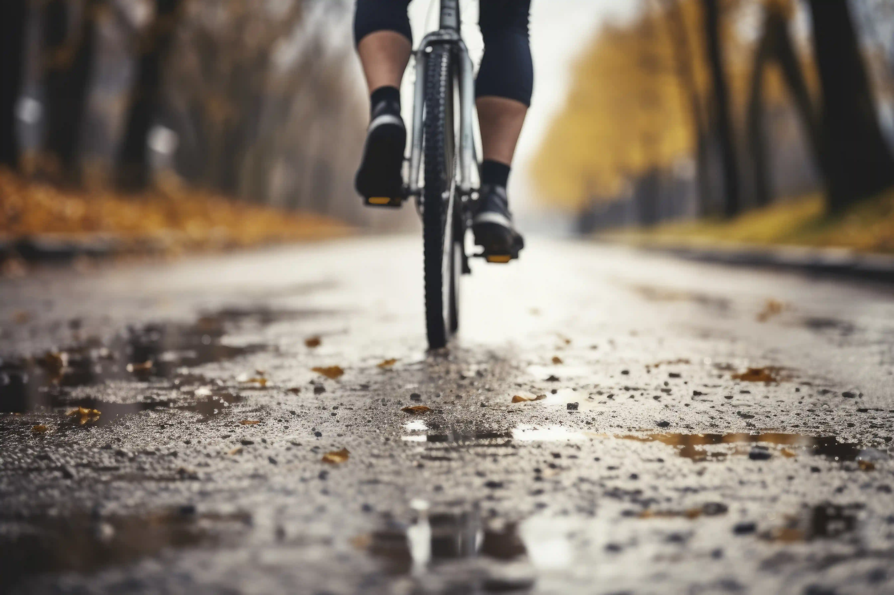

## Ride for everyone …

The cycle grades will allow you to understand what sort of ride you are looking at with the information necessary, to choose the perfect tour for you.

Keep in mind that the grades are somewhat subjective!

### The grades are based on various elements influencing the cycling level and the difficulty

- Total distance
- Elevation gain
- Terrain
- Technical difficulty
- Physical difficulty

*The weather conditions and altitude are not considered for the difficulty rating.*

*Each type of bicycle has its specific grading system.*

**E-BIKE:** We consider the E-bike like a regular bicycle with the same cycle grades.

**Duration:** the total activity duration from start to finish, including transport, etc.

**Duration trail:** the total duration of the cycle trail from start to finish, including panoramic viewpoints, snack breaks, picnics, etc.

<a href="/leisure-cycling.pdf" target="_blank">Download PDF for Leisure Cycling difficulty</a>
