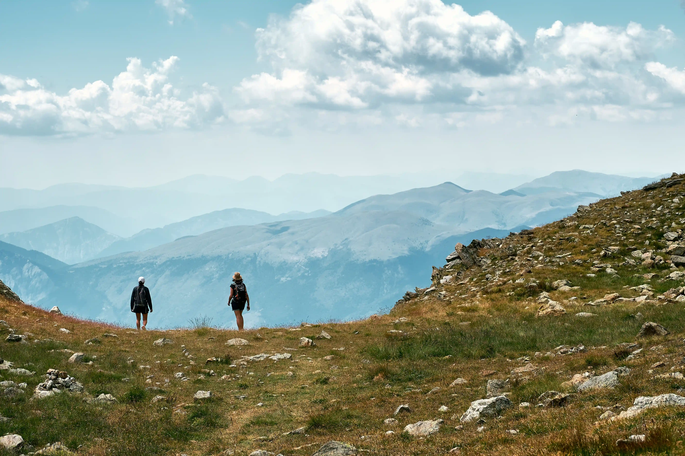
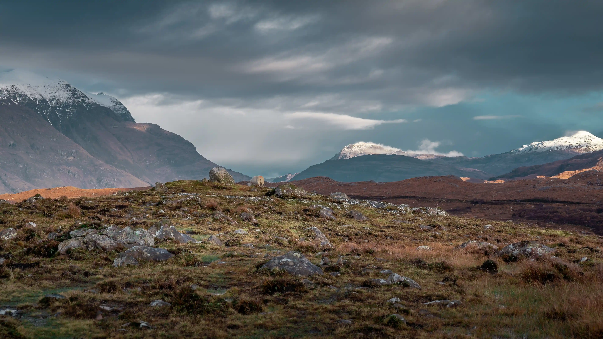

Mountain walking and hiking are active ways to explore the beautiful mountains. Hiking in the mountains is something different than walking in the city. Your hiking trail is never the same. With your backpack on, you walk along mountain paths through alpine meadows, rocky terrain, or grassy slopes and snow. Spectacular views of glaciers, high mountain ranges, and mountain lakes are your reward. After a long day with many meters of altitude, you reach the next hut, climb a peak, or return to the valley. Young and old, beginner or advanced, everyone can go mountain walking. It is important not to just go out, but to prepare yourself well so that you can go out safely.

Walking in the mountains is not only an experience for the eyes but also a well-being for the body and the mind that benefits beyond the physical aspect such as the purity of fresh and clean air improving respiratory function.

Walking in the mountains is a complete and natural exercise that engages the entire body improving muscle tone, strength, and cardiovascular benefits. Moreover, the varied terrain made of ascents and descents provides a true outdoor workout without the need for sophisticated equipment. It promotes blood circulation, reduces blood pressure, and enhances cardiovascular health. The mountain offers a scenario of peace and serenity beneficial to the mind. Away from the stress of daily life, immersing oneself in nature stimulates the mind, improving emotional well-being.

The mountains can embark on a personal challenge like reaching a summit, or completing a route provides a sense of personal achievement. These challenges, suitable for every fitness level, become incentives to surpass one's limits, increasing self-confidence.

Before you lace up your hiking boots there are key preparations to make at home.

**Planning**: Research and plan the technical part of the trial.

**Fitness**: Evaluate your fitness level and gradually improve your endurance and strength.

**Gear and Equipment**: It is important that your equipment and clothing are functional and contribute to your safety.

**Walking techniques**: Safe hiking in the mountains requires good mountain walking techniques as you will encounter all kinds of terrain.

**Orientation**: When walking in the mountains, it is very important to always know where you are and how should proceed.

**The weather**: Nothing is as changeable as the weather in the mountains.

What to do in case of an accident: You can greatly reduce the risks of mountain hiking by being aware of your experience, knowledge, and skills, and making choices.

**Put on your hiking shoes** and immerse yourself in a boundless journey for the body and mind, an experience that engages all the senses and enriches the mind, body, and spirit. The breath of pure air, the heartbeat uphill, the scent of pine: these elements make this practice a true ritual of well-being in a space of simplicity and authenticity.

***Contact us if you are planning a mountain walk or if you are new to hiking. We can inform you with essential tips, or check out our other blog posts!***